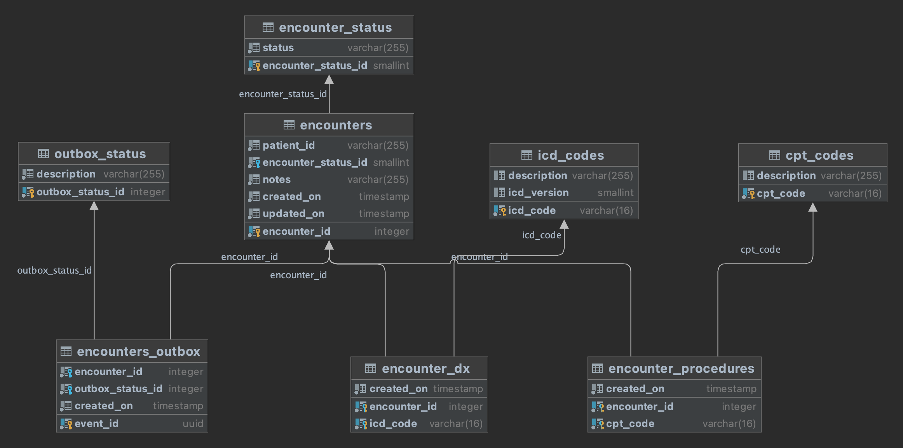

# Change Data Capture
## Proof of Concept
### Hypothesis
We have a legacy system with a significant amount of tightly-coupled cross-domain code and data that is high-risk. We need to start moving over some functionality to new services and applications as well as integrate 3rd party systems with the legacy system.

### Schema
We are using an `encounter` aggregate entity as an example. `encounter`s have a many-to-many relationship to `diagnosisCode`s and `procedureCode`s as well as a child-parent relationship to `encounterStatus`.

### Change Data Capture
We believe we can communicate state changes in our legacy system out to external components or systems without modifying code in our legacy system. By using CDC patterns, specifically an `outbox` pattern, we can see data mutation events as they happen.

#### Outbox
When rows are inserted or updated in the `encounters` table, `encounter_dx` table, and `encounter_procedures` table a trigger fires and inserts a row into `encounters_outbox`. The [EncounterService](src/main/java/com/svhelloworld/cdc/encounters/EncounterService.java) class polls the `encounters_outbox` table and will generate an event and publish it.

### BDD & Cucumber
The entry point for this PoC is [EncountersNotification.feature](src/test/resources/com/svhelloworld/cdc/cucumber/EncountersNotification.feature) BDD feature file. The glue code for the feature file is [EncounterNotificationSteps](src/test/java/com/svhelloworld/cdc/cucumber/steps/EncounterNotificationSteps.java) class. The project is instrumented with Spring dependency injection. The Cucumber glue code classes are all Spring beans so their lifecycle is managed by Spring. Dependencies are injected into test scenarios.

### Usage
This is a standard Maven project. All JUnit tests and Cucumber tests can be executed from a standard `mvn clean test` command. The database is required to execute the tests.

#### Database
The database is run from the `docker-compose.yml` file in the project root. The schema is built from the `db/schema.sql` file. The schema will be executed directly from the `docker-compose.yml` file.